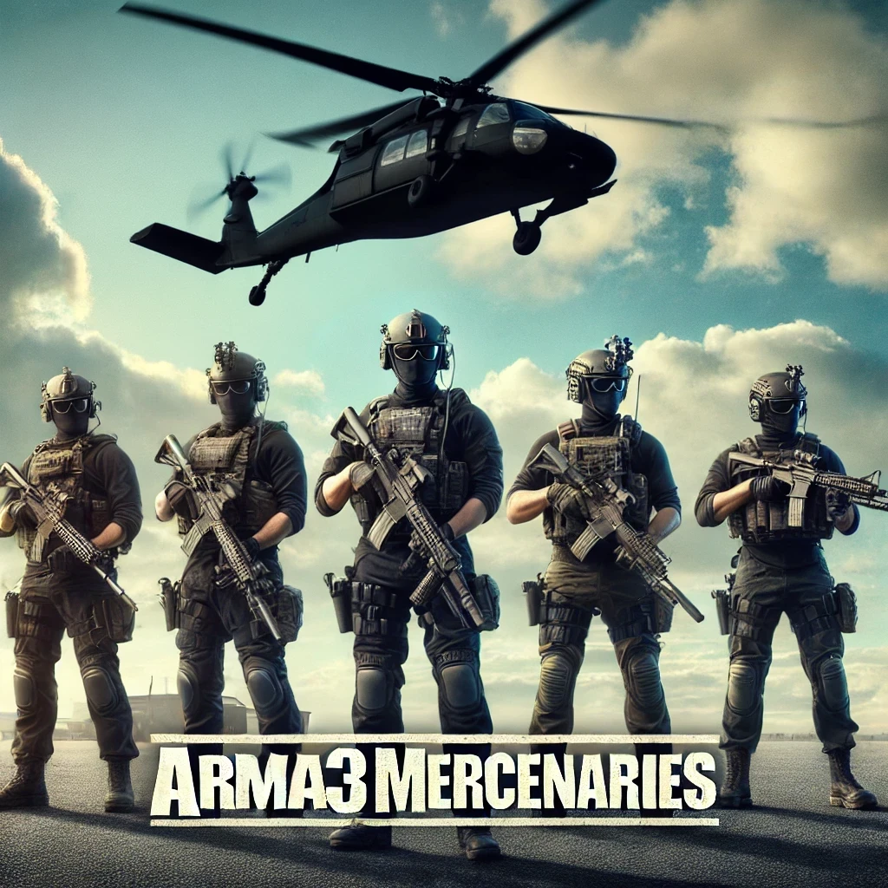

# Arma 3 Mercenaries (A3M)

Welcome to the official Wiki for **Arma 3 Mercenaries (A3M)**. This project is a highly persistent, database-driven mercenary management and territory control ecosystem. 

Driven by the ALiVE engine and powered by advanced asynchronous scripting architectures, A3M is a hardcore CO-OP experience that blends deep PvE logistical campaigns with punishing friendly-fire mechanics, while laying the long-term groundwork for future Asymmetric PvP.

---

## 📖 The Lore: Deniable Assets

You are a contractor for **Constellis**, operating on the jagged edge of legality under a classified contract for the CIA's Special Activities Center (SAC). The geopolitical landscape is fracturing, and conventional forces are tied up in red tape. You are the deniable asset they deploy to do the dirty work.

Your tactical superiority relies heavily on state-of-the-art C4ISR tech:
*   **Palantir Gotham / AIP:** Integrated via edge-compute servers installed at active radio towers across the AO, analyzing enemy movements in real-time.
*   **Anduril Menace-X:** Battlefield tactical analysis and drone integration.
*   **SpaceX Starshield:** Unhackable, high-bandwidth satellite communications linking your Panasonic Toughbooks directly to Langley.

While you are currently fighting a highly advanced, dynamic AI commander via ALiVE, the architecture is being laid for **Asymmetric PvP** on our roadmap. Soon, the Red faction (CSAT/FIA) will be fully playable, allowing you to be hunted by a thinking, breathing OPFOR player-base orchestrating the resistance against your PMC operations. 

*(Note: Currently, A3M is a hardcore CO-OP experience. Friendly Fire is always ON, and the economy severely penalizes killing friendlies or neutral civilians).*

---

## 🌍 Core Gameplay Mechanics

*   **Roadmap - Asymmetric PvP:** The foundation is being built for playable OPFOR factions (CSAT/FIA), allowing human players to hunt the PMC squads. (Currently in CO-OP phase with strict Friendly Fire penalties).
*   **The Mission Matrix:** Procedurally generated dynamic contracts (CSAR, HVT, Exfiltration, etc.) optimized through ALiVE Profile Virtualization and CBA Per-Frame Handlers to eliminate FPS drop.
*   **AI Unit Recruitment:** Recruit from different factions and create your own unique mercenary group!
*   **Kill Reward System:** You are dynamically rewarded and penalized for kills on the battlefield.  
*   **Persistent Wallet and Banking System:** Manage your finances through a detailed, SQLite-backed economic system.
*   **Persistent Player Inventory:** All items and equipment are remembered session after session.
*   **Persistent Player Groups:** Your squad and AI roster are saved, allowing you to maintain team dynamics across server restarts.
*   **Persistent Group Member Inventories:** Each AI member’s loadout is saved, ensuring your team's resources are always available.
*   **Persistent Garages:** Vehicles stored in garages are saved, including their exact state and inventory.
*   **Persistent Open World Vehicles:** Player-owned vehicles left on the battlefield are tracked and saved.
*   **Persistent Static Weapons:** Player-owned static weapons placed in the world are persistent.
*   **Persistent Fortifications:** Build custom bases and FOBs that remain persistent across deployments.
*   **Persistent Storage Containers:** Player-placed storage containers (via the fortification system) remain in place with all inventory items saved.

---

## 🏗️ Architecture & Module Features

The A3M codebase is divided into highly modular systems. Below is a map of every core module inside the `arma3mercenaries` directory and its functional purpose:

### 💾 Core Persistence & Database
*   **`persistence`**: The backbone of the A3M architecture. Contains the Rust/SQLite bridge functions (`A3M_fnc_dbGetSecure`, `A3M_fnc_dbSetSecure`) that completely replace the vanilla `profileNamespace` saving system for unparalleled stability.

### 🪖 AI Mercenary & Squad Management
*   **`barracks`**: The production Virtual Barracks system. Handles the SQLite-backed deployment and stowing of AI mercenaries (`fn_serverDeployMercenary.sqf`, `fn_stowMercenary.sqf`) and initializes the physical barracks object.
*   **`mercenaries`**: Core AI initialization (`fn_initMercenary.sqf`). Generates unique database identities for newly purchased AI, sets up their wallets, and registers them globally to the server.
*   **`set_group_captive`**: The **Two-Layer Captive System**. Handles the complex logic of re-claiming AI after a server restart (`groupRejoin.sqf`), safely transferring network locality to the player, and dynamically applying ACE handcuffs so players can manually "Mobilize" them.
*   **`group_teleport`**: Utility scripts allowing squad leaders to teleport rogue or stuck AI group members back to their position.

### 📊 Player Progression & Interface (UI)
*   **`player_profile`**: The central UI hub. Contains the **Player Card** and **Squad Dossier** systems. Tracks and displays live player stats (Kills, Deaths, Money, Pedometer Distance) and provides the interface for managing the active AI roster.
*   **`leaderboard`**: The global server leaderboard. Pulls stats directly from SQLite to rank players and allows inspection of other players' profiles.
*   **`disable_abort_button`**: A UI override module that explicitly disables the ESC menu "Abort" button, preventing combat-logging and forcing players to exit via specific game mechanics.

### 💰 Economy, Kills & Territory
*   **`kill`**: The consolidated Kill Handler (`arma3mercenaries_killHandler.sqf`). A massive logic controller that manages the killfeed, registers deaths into the SQLite database, and calculates monetary rewards/penalties when units or vehicles are destroyed.
*   **`bounty`**: The Bounty Board UI. Interfaces with the database to display active High Value Target (HVT) bounties and allows players to fetch bounty data (`fn_openBountyBoard.sqf`).
*   **`sector_control`**: Dynamic territory management. Spawns zone defenders (`fn_spawnSectorControlUnitsTick.sqf`) and issues recurring monetary rewards to whichever faction is currently holding the sector (`fn_manageSectorsTick.sqf`).

### 🎯 The Mission Matrix, Tasks & ALiVE Integration
*   **`a3m_contracts`**: The dynamic mission generator. Contracts like `fn_generateHVT.sqf`, `fn_generateCSAR.sqf`, and `fn_generateExfiltration.sqf`. These scripts utilize **ALiVE Profile Virtualization** and **CBA Per-Frame Handlers** to run complex scenarios seamlessly with zero native FPS drain.
*   **`interrogations`**: Scripts specifically dedicated to capturing and interrogating HVTs or units for intel.
*   **`ALiVE`**: A massive folder dedicated to integrating A3M with the ALiVE mod. Handles dynamic mission creation, custom ALiVE task rewards (`aliveTaskReward.sqf`), capturing logic (`aliveCaptured.sqf`), and whitelist overrides for persistence (`aliveFortificationWhitelist.sqf`).

### 🚁 Support & Immersion
*   **`combat_support`**: The modernized, unified combat support system. Uses a highly optimized HashMap (`fn_requestCombatSupport.sqf`) to let players call in Artillery, CAS, and Transport.
*   **`supply_drops`**: Scripts allowing players to request and parachute physical supply crates onto the battlefield.
*   **`jukebox`**: A custom music and ambient audio player module.
*   **`tutorials`**: Handles the in-game hint and tutorial system to guide new players through the custom A3M mechanics.

---

## ⚙️ The Initialization Pipeline (Engine Bootup)

To understand how A3M actually runs under the hood, here is the exact bootup sequence that occurs when the server launches and players connect:

### 1. `init.sqf` (Runs globally on BOTH Server and Clients)
This script fires universally and establishes base mechanics before player input:
*   **Vcom AI:** Executes `Vcom\VcomInit.sqf` to boot up the advanced AI driving and combat behaviors.
*   **Respawn Parameters:** Fetches the mission parameter `respawnDelay` and applies it globally.
*   **ALiVE Custom Override:** Compiles `arma3mercenaries\ALiVE\fnc_spawnProfileGroup.sqf` to override default ALiVE spawns.
*   **Global Kill Handler:** Executes `arma3mercenaries\kill\arma3mercenaries_killHandler.sqf`. This massive script hooks into the engine's `MPKilled` event to manage the killfeed, determine killer attribution, and issue global monetary rewards.

### 2. `initServer.sqf` (Runs ONLY on the Dedicated Server)
This is the backend brain of the mission. It handles the database, memory, and saving:
*   **The SQLite Database Bridge:** Initializes `A3M_fnc_dbSetSecure` and `A3M_fnc_dbGetSecure`, creating the direct communication tunnel to the `a3m_db_core` Rust extension.
*   **Player Profile Engine:** Defines `A3M_fnc_initPlayerProfile`, which constructs the HashMaps tracking every player's persistent stats (Kills, Distance Walked, Suicides, Playtime) and saves them to the DB.
*   **Virtual Barracks Backend:** Compiles all server-side deployment scripts (`fn_serverDeployMercenary.sqf`, `fn_serverStowMercenary.sqf`).
*   **Mercenary Persistence Hook:** Sets up a continuous background loop (`CBA_fnc_addPerFrameHandler`) that scans the server for restored AI mercenaries and dynamically registers their death events to track their SQLite stats.
*   **Client Data Fetchers:** Compiles the server-side handlers (`A3M_fnc_serverFetchProfileForClient`, `A3M_fnc_serverFetchSquadDossier`) so connecting clients can request their database info.

### 3. `initPlayerLocal.sqf` (Runs ONLY on the Player's Client)
This dictates exactly what the player sees, hears, and interacts with:
*   **Ambiance & Tracking:** Boots up the personal Jukebox (`playRandomTracks.sqf`), ambient radio chatter, and executes `fn_initPedometer.sqf` to track the player's walking distance in the background.
*   **HoverGuy Initialization:** Executes `HG_initPlayerLocal.sqf` to set up client-side shop and economy data.
*   **ACE Self-Interact Hierarchy:** Dynamically builds your personal ACE menu (`[Emergency Support]`, `[Squad Commands]`, `[Constellis Database]`).
*   **Squad Management Logic:** Executes `arma3mercenaries\set_group_captive\groupRejoin.sqf` to automatically reclaim persistent AI. It also binds actions like "Recall Squad" and "Quick Load".
*   **Database & UI Interfaces:** Compiles all the client-side functions needed to open and receive data for the Player Card, Squad Dossier, and Leaderboard.
*   **Dynamic ACE Interactions (The Overhaul):** Dynamically attaches interactions like "Access Quartermaster", "Claim Vehicle", "Lock/Unlock", "Flip Vehicle", and "Mobile Respawn" universally to all relevant vehicles, objects, and NPCs across the entire map.

### 4. `initPlayerServer.sqf` (Runs on the Server WHEN a player connects)
This acts as the handshake between the connecting client and the server:
*   **Profile Bootup:** The second a player logs in, it extracts their UID and fires `A3M_fnc_initPlayerProfile` to fetch their SQLite profile, update their `Last_Deployment_Date`, and load them into active server memory.
*   **HoverGuy Sync:** Executes `HG\Setup\fn_playerServerInitialization.sqf` to sync the connecting player's bank account and Garage data.

*(Note: `description.ext` also acts as a pseudo-init by pre-compiling all the `grad-persistence`, `grad-moneyMenu`, and custom `A3M` dialogs before any of these scripts even run).*
